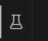
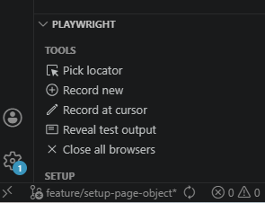
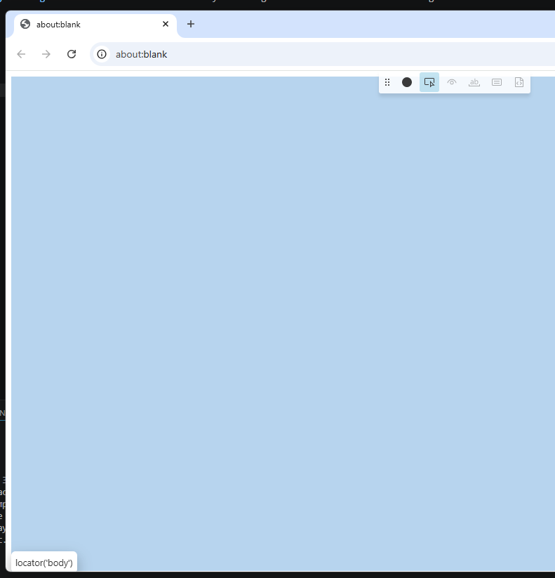
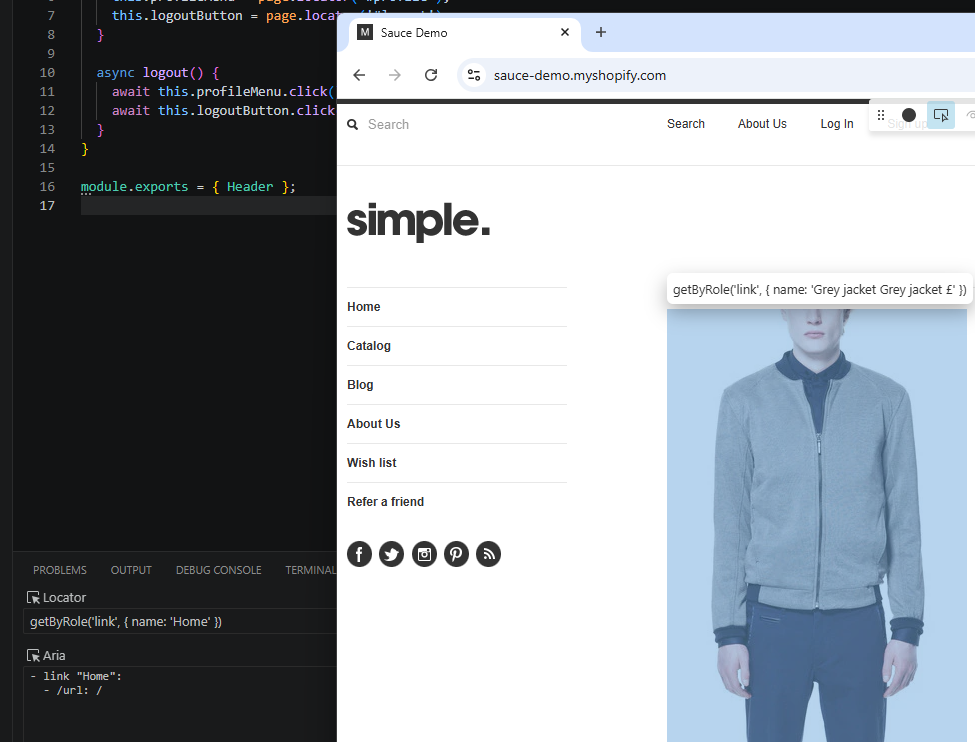

# Useful Help

## Running the Location / Debugger Helper

Use the command ```npx playwright codegen``` or use the VS extension by clicking on the tests tab and selecting tools at the bottom left and pick locator.





Will load the debugger browser



Enter a URL and get started.

Once you click an element the Playwright output in VS code will give you some possible selectors.

